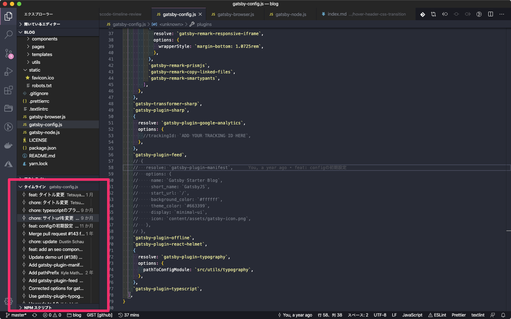
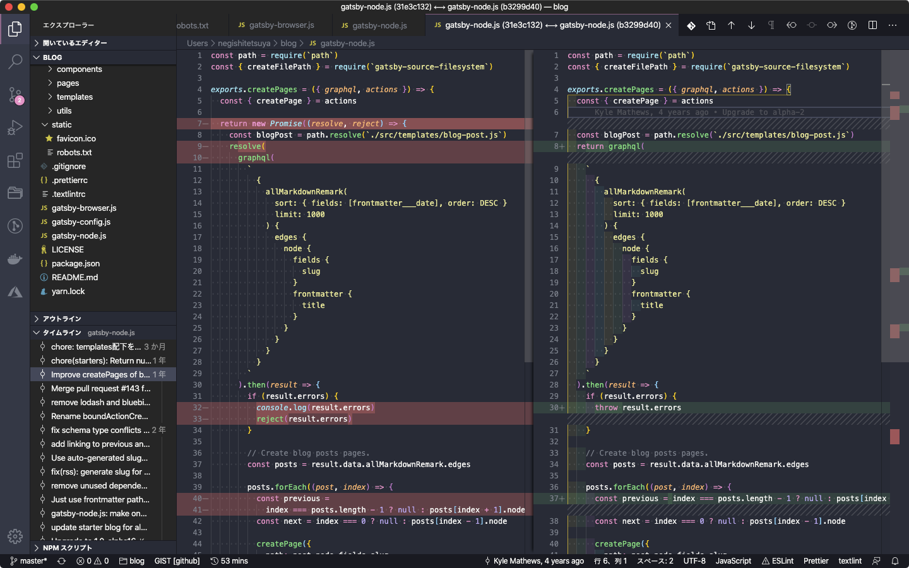

VSCodeのv1.44にタイムラインという機能が追加されました。

VSCodeをv1.44以上にアップデートしてサイドバーを開くとタイムラインというセクションが表示されます。

タイムラインには今開いているファイルのコミット履歴が表示されます。
また、コミット履歴をクリックするとコミットのdiffが開きます。

Gitの履歴を確認するときは[GitLens](https://marketplace.visualstudio.com/items?itemName=eamodio.gitlens)を使うのが定番でした。
ちょっとした確認はタイムラインを使って、がっつり調べるときはGitLensを使うと良さそうです。
